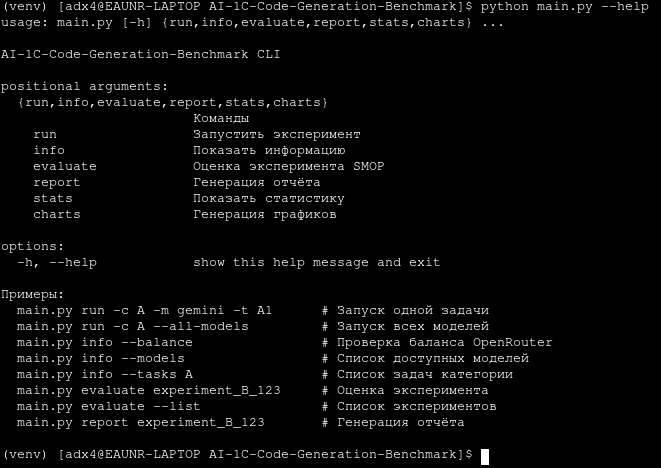
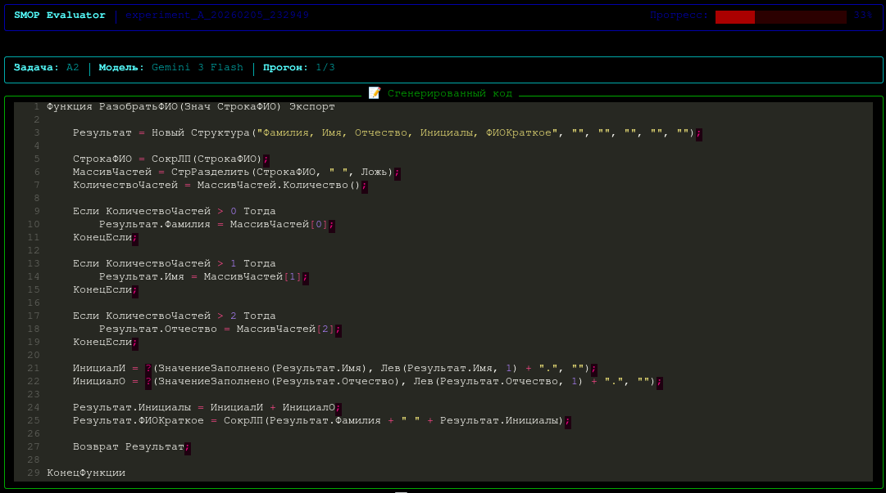

<div align="center">

# GenLab-1C Core

**Открытое вычислительное ядро платформы GenLab-1C**

Научный инструментарий для экспериментальной оценки эффективности LLM  
в генерации кода для доменно-специфичных платформ

[](LICENSE)
[](https://python.org)
[](https://github.com/4dand/1c-ai-codegen-research-paper)
[](https://github.com/4dand/genlab-1c-web)

</div>

---

## О проекте

Этот репозиторий содержит **открытое ядро платформы GenLab-1C** — программного комплекса, разработанного для проведения научного эксперимента в рамках НДР-2026:

> *«Экспериментальная оценка эффективности искусственного интеллекта в генерации кода для доменно-специфичных платформ (на примере 1С:Предприятие 8)»*

Ядро реализует всю вычислительную логику: генерацию через LLM, экспертную оценку по методике SMOP, статистическую обработку и визуализацию результатов.

**Связанный репозиторий научной работы:** [4dand/1c-ai-codegen-research-paper](https://github.com/4dand/1c-ai-codegen-research-paper)  
**Веб-платформа для коллективной оценки:** [4dand/genlab-1c-web](https://github.com/4dand/genlab-1c-web)

### Зачем собственный инструмент?

Существующие ИИ-ассистенты (GitHub Copilot, Cursor IDE, 1C:Напарник) не удовлетворяют требованиям научного эксперимента:
они представляют собой «чёрные ящики» без доступа к параметрам генерации, без API для пакетной обработки и без механизмов формализованной оценки.

GenLab-1C Core разработан специально для исследований и обеспечивает:

- **Воспроизводимость** — управление `temperature` и `seed`, хеширование ответов, фиксация полной конфигурации
- **Прозрачность** — исходный код открыт под MIT, никаких чёрных ящиков
- **Масштабируемость** — пакетный запуск сотен генераций без ручного вмешательства
- **Формализованную оценку** — встроенная методика SMOP с TUI-интерфейсом для эксперта
- **Статистику** — t-интервалы, каппа Коэна, корреляция Пирсона, графики для публикаций

---

## Быстрый старт

### Установка

```bash
git clone https://github.com/4dand/genlab-1c-core.git
cd genlab-1c-core
pip install -r requirements.txt
```

Или как Python-пакет (для использования `src` из других проектов):

```bash
pip install -e ".[dev]"
```

### Настройка

```bash
cp .env.example .env
# Откройте .env и вставьте ваш ключ OpenRouter
```

```env
OPENROUTER_API_KEY=sk-or-v1-ваш-ключ
```

> Получить ключ: [openrouter.ai/keys](https://openrouter.ai/keys)

### Первый эксперимент

```bash
# Запустить задачу A1 с моделью Gemini
python main.py run -c A -m gemini -t A1

# Запустить все задачи категории A для всех моделей
python main.py run -c A --all-models

# Запустить категорию B с использованием MCP-сервера
python main.py run -c B -m claude --no-mock
```

После выполнения:

```bash
# Открыть интерфейс экспертной оценки
python main.py evaluate experiment_A_YYYYMMDD_HHMMSS

# Построить отчёт (HTML + LaTeX + JSON)
python main.py report experiment_A_YYYYMMDD_HHMMSS

# Сгенерировать графики отдельно
python main.py charts experiment_A_YYYYMMDD_HHMMSS
```

---

## Настройка конфигурации

Весь эксперимент управляется YAML-файлами в папке `configs/`. Менять код не нужно — только конфиги.

### `configs/settings.yaml` — глобальные пути и параметры

```yaml
openrouter:
  base_url: "https://openrouter.ai/api/v1"
  timeout: 120

mcp:
  url: "http://localhost:8000"   # URL MCP-сервера (vladimir-kharin/1c_mcp)
  timeout: 30

paths:
  configs_dir: "configs"
  raw_results_dir: "raw_results"
  code_outputs_dir: "code_outputs"
  evaluations_dir: "evaluations"
  reports_dir: "reports"
```

### `configs/models.yaml` — добавление моделей

Каждая модель задаётся ключом (используется в CLI через `-m <ключ>`):

```yaml
models:
  gemini:
    id: "google/gemini-3-flash-preview"
    name: "Gemini 3 Flash"
    generation:
      temperature: 0.0
      seed: 42
    meta:
      price_input: 0.075    # $ / 1M токенов
      price_output: 0.30
```

### `configs/tasks_category_A.yaml` — добавление задач

```yaml
category:
  name: "A"
  description: "Алгоритмические задачи"
  requires_mcp: false

system_prompt: |
  Ты — эксперт по разработке на 1С:Предприятие 8.3.
  Генерируй только код на встроенном языке 1С.

tasks:
  - id: "A1"
    name: "Сортировка пузырьком"
    difficulty: "easy"
    prompt: "Реализуй функцию сортировки массива методом пузырька..."
```

### Подключение MCP-сервера (`vladimir-kharin/1c_mcp`)

MCP-сервер предоставляет доступ к метаданным реальной конфигурации 1С и необходим для задач **категории B**.

**1. Запустить сервер через Docker:**

```bash
docker pull vladimirkharin/1c_mcp
docker run -d -p 8000:8000 vladimirkharin/1c_mcp
```

Подробнее об инструментах и поддерживаемых конфигурациях: [vladimir-kharin/1c_mcp](https://github.com/vladimir-kharin/1c_mcp)

**2. Убедиться что URL совпадает с `configs/settings.yaml`:**

```yaml
mcp:
  url: "http://localhost:8000"
```

**3. Запустить эксперимент без mock:**

```bash
python main.py run -c B -m gemini --no-mock
```

Без флага `--no-mock` фреймворк использует встроенные mock-данные УТ 11.5 (`tests/mocks/mcp_mock.py`) — сервер не нужен.

---

## Методология: SMOP

Качество сгенерированного кода оценивается экспертами по четырём критериям:

| Критерий | Расшифровка | Что оценивается |
|----------|-------------|-----------------|
| **S** | Syntax | Синтаксическая корректность BSL-кода |
| **M** | Meaning | Семантическая корректность, соответствие логики заданию |
| **O** | Optimization | Следование стандартам разработки 1С, эффективность |
| **P** | Platform | Корректность работы с метаданными и объектами платформы |

Каждый критерий оценивается по шкале: **{0, 2, 4, 6, 8, 10}**

Интегральный показатель качества:

$$Q = \frac{S + M + O + P}{4}$$

| Уровень | Q | Интерпретация |
|---------|---|---------------|
| Высокий | ≥ 7.0 | Код готов к использованию |
| Приемлемый | ≥ 4.0 | Требует доработки |
| Низкий | < 4.0 | Неприемлемое качество |

Детальные описания критериев для каждого уровня шкалы: [`configs/smop_criteria.yaml`](configs/smop_criteria.yaml)

---

## Категории задач

### Категория A — Алгоритмические задачи

Задачи на алгоритмическую логику в синтаксисе 1С без зависимости от метаданных конкретной конфигурации. Позволяют оценить базовую компетентность модели в языке BSL.

Примеры: сортировка пузырьком, парсинг строки ФИО, подсчёт рабочих дней, работа с JSON, группировка таблицы значений.

### Категория B — Платформенные задачи

Задачи, требующие знания объектов метаданных конкретной конфигурации (УТ 11.5). Для их выполнения модель использует **Agentic Context Loader** — агент, который через MCP-сервер динамически исследует структуру конфигурации и собирает нужный контекст перед генерацией.

Примеры: получение остатков товаров, заполнение цен в ТЧ, списание по FIFO, расчёт себестоимости, пересчёт валютных сумм.

```bash
# Запуск с реальным MCP-сервером (Docker)
docker run -d -p 8000:8000 vladimir-kharin/1c_mcp
python main.py run -c B --all-models --no-mock

# Запуск с mock-данными (УТ 11.5, без Docker)
python main.py run -c B --all-models
```

---

## Поддерживаемые модели

| Модель | OpenRouter ID | Детерминизм | Окно контекста |
|--------|--------------|-------------|----------------|
| Claude Opus 4.5 | `anthropic/claude-opus-4.5` | `temperature=0` | 200K |
| GPT-5.2 Codex | `openai/gpt-5.2-codex` | `seed` | 400K |
| Gemini 3 Flash | `google/gemini-3-flash-preview` | `seed` | 1M |

Добавить новую модель: [`configs/models.yaml`](configs/models.yaml)

---

## Структура репозитория

```
genlab-1c-core/
│
├── configs/                    # Конфигурация экспериментов
│   ├── models.yaml             # Параметры LLM-моделей
│   ├── tasks_category_A.yaml   # Задачи категории A (алгоритмические)
│   ├── tasks_category_B.yaml   # Задачи категории B (платформенные)
│   ├── smop_criteria.yaml      # Критерии SMOP с описаниями шкалы
│   ├── experiment.yaml         # Метаданные эксперимента
│   └── settings.yaml           # Глобальные настройки
│
├── src/
│   ├── clients/                # HTTP-клиенты внешних сервисов
│   │   ├── openrouter.py       # Клиент OpenRouter API
│   │   └── mcp.py              # Клиент MCP-сервера (Streamable HTTP)
│   ├── core/                   # Вычислительное ядро
│   │   ├── benchmark.py        # BenchmarkRunner — оркестратор экспериментов
│   │   └── context_loader.py   # AgenticContextLoader — агент сбора контекста
│   ├── evaluator/              # Модуль оценки и анализа
│   │   ├── smop.py             # SMOPEvaluator, SMOPCriteria
│   │   ├── statistics.py       # Статистика, ДИ, каппа Коэна
│   │   ├── charts.py           # Графики (matplotlib, publication-ready)
│   │   ├── report.py           # Генерация HTML/JSON/LaTeX-отчётов
│   │   ├── dashboard.py        # TUI-интерфейс для экспертной оценки
│   │   ├── parser.py           # Парсинг raw_results для оценки
│   │   └── schemas.py          # Pydantic-схемы оценки
│   ├── schemas/                # Общие схемы данных
│   ├── config/                 # Загрузка и валидация конфигурации
│   ├── cli/                    # CLI-обработчики команд
│   └── utils/                  # Утилиты (хеширование, экспорт, файлы)
│
├── tests/
│   └── mocks/
│       └── mcp_mock.py         # Mock МСP-клиент с данными УТ 11.5
│
├── docs/
│   └── evaluator.md            # Документация модуля оценки
│
├── main.py                     # CLI точка входа
├── requirements.txt
└── .env.example
```

---

## Справочник команд

```bash
# Информация
python main.py info --balance          # Баланс OpenRouter API
python main.py info --models           # Список доступных моделей
python main.py info --tasks A          # Задачи категории A с описаниями
python main.py info --tasks B          # Задачи категории B с описаниями

# Запуск экспериментов
python main.py run -c A -m gemini                  # Одна модель, категория A
python main.py run -c A -m claude -t A1 A3         # Конкретные задачи
python main.py run -c A --all-models               # Все модели
python main.py run -c B -m gemini                  # Категория B (mock MCP)
python main.py run -c B -m gemini --no-mock        # Категория B (реальный MCP)

# Экспертная оценка (TUI)
python main.py evaluate --list                     # Список доступных экспериментов
python main.py evaluate experiment_A_YYYYMMDD      # Открыть TUI-интерфейс оценки

# Отчёты и аналитика
python main.py report experiment_A_YYYYMMDD        # HTML + JSON + LaTeX
python main.py stats  experiment_A_YYYYMMDD        # Вывод статистики в терминал
python main.py charts experiment_A_YYYYMMDD        # Только графики
```

---

## Выходные артефакты

```
raw_results/
└── experiment_A_YYYYMMDD_HHMMSS.json     # Сырые результаты с хешами и метриками

code_outputs/
└── experiment_A_YYYYMMDD_HHMMSS/
    └── A1_Сортировка/
        ├── claude_run_1.bsl              # Сгенерированный код по прогонам
        └── claude_run_2.bsl

evaluations/
└── experiment_A_YYYYMMDD_expert_01.json  # Экспертные оценки SMOP

reports/
├── experiment_A_YYYYMMDD_report.html     # Интерактивный HTML-отчёт
├── experiment_A_YYYYMMDD_report.json     # Структурированные метрики
├── experiment_A_YYYYMMDD_tables.tex      # LaTeX-таблицы для публикации
└── charts/
    └── experiment_A_YYYYMMDD/
        ├── smop_radar.png                # Радарные диаграммы SMOP
        ├── models_comparison.png         # Сравнение моделей с ДИ
        ├── heatmap_tasks_models.png      # Тепловая карта задача × модель
        ├── scores_distribution.png       # Распределение оценок
        ├── boxplot_by_model.png          # Boxplot по моделям
        └── determinism_vs_quality.png    # Корреляция детерминизм / качество
```

---

## Интерфейсы

### CLI — запуск экспериментов



*Основной CLI-интерфейс: команды run, info, evaluate, report, stats, charts*

### TUI — экспертная оценка SMOP



*Терминальный интерфейс для проставления оценок S, M, O, P по каждому прогону.  
Навигация по задачам, подсветка кода, автосохранение, индикация прогресса.*

---

## Документация

| Файл | Описание |
|------|----------|
| [docs/evaluator.md](docs/evaluator.md) | Модуль оценки: SMOP, формулы статистики (ДИ, каппа Коэна, корреляция Пирсона), API-справочник, примеры кода |

---

## Вклад в проект

Проект ориентирован на исследовательское сообщество. Способы участия:

- **Новые задачи** — добавить в `configs/tasks_category_*.yaml`
- **Новые модели** — добавить в `configs/models.yaml`
- **Новые категории** — создать `tasks_category_C.yaml` и задать `requires_mcp`
- **Улучшение статистики** — `src/evaluator/statistics.py`
- **Баги и предложения** — [открыть issue](https://github.com/4dand/genlab-1c-core/issues)

```bash
git clone https://github.com/4dand/genlab-1c-core.git
cd genlab-1c-core
pip install -r requirements.txt
cp .env.example .env  # добавьте OPENROUTER_API_KEY
python main.py run -c A -m gemini -t A1
```

---

## Научный контекст

Этот репозиторий является частью комплекса публикаций НДР-2026:

| Артефакт | Ссылка |
|----------|--------|
| Полный текст работы, данные экспериментов, результаты оценки | [4dand/1c-ai-codegen-research-paper](https://github.com/4dand/1c-ai-codegen-research-paper) |
| Исходный код ядра (этот репозиторий) | [4dand/genlab-1c-core](https://github.com/4dand/genlab-1c-core) |
| Веб-платформа для коллективной экспертной оценки | [4dand/genlab-1c-web](https://github.com/4dand/genlab-1c-web) |
| MCP-сервер для доступа к метаданным 1С:Предприятие | [vladimir-kharin/1c_mcp](https://github.com/vladimir-kharin/1c_mcp) |

---

## Лицензия

[MIT](LICENSE) — свободное использование, модификация и распространение с сохранением указания авторства.

---

<div align="center">

Андреев Данила · Гальцкова Юлия Михайловна · НДР-2026

</div>
